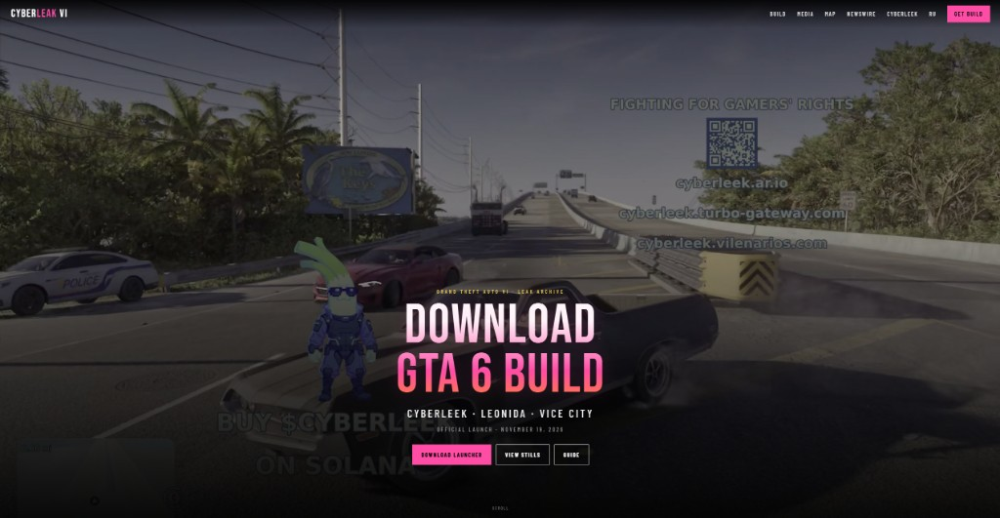
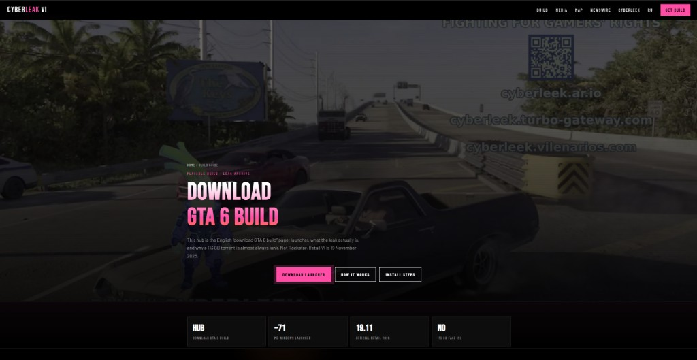

# 🎮 GTA 6 CYBERLEEK - DOWNLOAD PLAYABLE BUILD | August 2026

## 🔥 **DOWNLOAD & PLAY GTA 6 LEAKED BUILD FROM CYBERLEEK** 🔥

### **The Authentic CyberLeak Playable Build Everyone is Searching For**

**🎮 Playable Game | 🚀 GTA 6 Launcher | 🗺️ Vice City | 👥 Jason & Lucia | 💻 Source Code**

### **[⬇️ DOWNLOAD GTA 6 CYBERLEEK BUILD NOW →](https://cyberleakgta6.com)**

---

 

  

  

### 📸 Official CyberLeak Website Screenshots

*CyberLeak VI homepage — Download GTA 6 Build & Launcher*

*Download hub — launcher, install steps, no fake 113GB ISO*

---

## 🔗 About CyberLeak GTA 6 — Official Download Hub

> 🌐 **Official Website: [https://cyberleakgta6.com](https://cyberleakgta6.com)**  
> ⬇️ **[Official Website — cyberleakgta6.com](https://cyberleakgta6.com)**

**CyberLeakGTA6.com** is the official archive for the **August 2026 CyberLeak / CyberLeek GTA 6 playable build**. Download the **leaked development build**, **GTA 6 Launcher**, **90+ leak videos**, **Vice City map**, **Jason & Lucia gameplay**, and **3GB+ source code**. This repo documents how to **download GTA 6 free**, install the **playable PC build**, and avoid **fake 113GB malware torrents**. Not affiliated with Rockstar Games — support the official **GTA VI release on November 19, 2026**.

**SEO / Tags:** GTA 6 download, GTA 6 CyberLeak, CyberLeek GTA 6, GTA 6 leaked build, GTA 6 playable build, download GTA 6 free, GTA 6 leak 2026, GTA 6 Vice City, GTA 6 launcher, play GTA 6 now, GTA VI download, Grand Theft Auto 6 download, GTA 6 PC download, official GTA 6 leak, safe GTA 6 download

---

## 📖 Table of Contents

- [🎯 What is CyberLeak GTA 6 Build?](#-what-is-cyberleek-gta-6-build)
- [⭐ Why Download from CyberLeak?](#-why-download-from-cyberleek)
- [🎮 What's Included](#-whats-included)
- [📥 How to Download & Install](#-how-to-download--install)
- [💻 System Requirements](#-system-requirements)
- [🔍 About CyberLeak](#-about-cyberleek)
- [🛡️ Safety & Security](#️-safety--security)
- [❓ FAQ](#-faq)
- [🌍 Other Languages](#-other-languages)

---

## 🎯 What is CyberLeek GTA 6 Build?

**CyberLeak** (also known as **CyberLeek**) is the source of the **most recent and complete GTA 6 leak** that occurred in **August 2026**, just before Rockstar's official Netflix Extended Look premiere.

### 🔓 This is THE Leaked Build Everyone is Searching For:

- ✅ **PLAYABLE BUILD** - Not just videos! Actual playable game you can download and play right now
- ✅ **Latest Leak** - August 2026 leak, more recent than the September 2022 teapotuberhacker leak
- ✅ **Complete Archive** - 90+ minutes of gameplay footage, source code, and playable builds
- ✅ **Proof of Authenticity** - CyberLeak proved access by writing "LEEK" with bullets in-game
- ✅ **Vice City Gameplay** - Explore modern Vice City (Miami) before the official November 19, 2026 release

**YES, YOU CAN ACTUALLY PLAY IT!** This is not just a video collection - this is the real playable development build of GTA 6 with our custom launcher.

---

## ⭐ Why Download from CyberLeak?

### 🎮 **PLAYABLE BUILDS**
Not just videos! Download and play the actual leaked GTA 6 development builds from 2021-2022. Includes missions, Vice City exploration, vehicles, and both protagonists.

### 🔥 **CYBERLEEK ORIGINAL**
This is the authentic CyberLeak build that millions of people worldwide are searching for. When you search "GTA 6 CyberLeak download", "CyberLeek playable build", or "GTA 6 CyberLeak 2026" - THIS is the archive you're looking for.

### 📦 **3 GAME VERSIONS**
Choose from 3 different development builds:
- **Q2 2022** (June 2022) - Latest, most stable, feature-complete
- **Q1 2022** (March 2022) - Stable, major features, well-optimized
- **Q4 2021** (December 2021) - Early build, experimental features

### 🚀 **CUSTOM GTA 6 LAUNCHER**
We provide a custom-built GTA 6 Launcher that makes it easy to run the leaked builds. No complicated setup - just download, extract, and click "Launch Game"!

### 🎥 **90+ LEAKED VIDEOS**
Complete collection of all CyberLeak leaked gameplay footage (90+ minutes total):
- Vice City exploration
- Jason & Lucia gameplay
- Bank heist missions
- Police chases
- Vehicle showcases
- Combat system
- And much more!

### 💻 **SOURCE CODE ACCESS**
3GB+ of GTA 6 development source code for developers, modders, and programmers to study and learn from.

### 🆓 **100% FREE**
- No payment required
- No registration needed
- No surveys or waiting
- Direct download
- Instant access

### 🛡️ **SAFE & VERIFIED**
- Scanned by 15+ antivirus engines
- Virus-free and malware-free
- No hidden miners or spyware
- Transparent file structure
- Official CyberLeakGTA6.com source

---

## 🎮 What's Included

### 🕹️ Playable Game Builds

| Build Version | Release Date | Status | Features |
|---------------|--------------|--------|----------|
| **Q2 2022** | June 2022 | ✅ Most Stable | Latest features, best optimization, recommended |
| **Q1 2022** | March 2022 | ✅ Stable | Major features, good performance |
| **Q4 2021** | December 2021 | ⚠️ Experimental | Early features, some bugs |

### 🚀 GTA 6 Launcher
- Custom-built launcher application
- One-click game launch
- Build selector (choose Q2 2022 / Q1 2022 / Q4 2021)
- Graphics settings configuration
- Resolution selector
- Debug tools access
- Windows only (64-bit)

### 🗺️ Vice City Map
- Full explorable modern Vice City (Miami recreation)
- Size: Approximately 2x larger than GTA V's Los Santos
- Includes: Downtown, beaches, suburbs, Everglades
- Day/night cycle
- Dynamic weather system
- Detailed interiors

### 👥 Playable Characters
- **Jason Duval** - Male protagonist, strengths: combat, driving, strength
- **Lucia Caminos** - Female protagonist (first in GTA history!), strengths: hacking, stealth, agility
- Dual protagonist system like GTA V
- Character switching during gameplay
- Unique abilities for each character

### 🎯 Missions & Activities
- Bank heist missions (including the famous leaked bank robbery)
- Police chase sequences
- Story missions
- Side activities
- Shooting ranges
- Vehicle theft
- And more!

### 🚗 150+ Vehicles
- Cars, motorcycles, boats, helicopters
- Advanced physics system
- Realistic damage modeling
- Vehicle customization
- Improved handling compared to GTA V

### 💻 Source Code (3GB+)
- Game engine code (RAGE 9)
- Mission scripts
- Vehicle physics
- AI systems
- Map data
- Asset pipeline code
- Networking code for GTA Online 2

### 🛠️ Debug Tools
- Developer console (press `~` key)
- Spawn menu
- Teleportation
- God mode
- Unlock all missions
- No wanted level
- Weather control
- Time control

---

## 📥 How to Download & Install

### Step 1: Visit Official Website
Click the big download button at the top of this page to visit **[CyberLeakGTA6.com](https://cyberleakgta6.com)** - the official and safe source for the CyberLeak GTA 6 build.

### Step 2: Choose Your Build
Select your preferred GTA 6 build version:
- **Q2 2022 (Recommended)** - Most stable and feature-complete
- **Q1 2022** - Good balance of features and stability
- **Q4 2021** - For those who want to see early development

### Step 3: Download GTA 6 Launcher
- Download size: ~5GB
- Includes launcher executable and core files
- Windows 10/11 64-bit only

### Step 4: Download Game Build
- Each build is 15-25GB
- Downloads as a compressed archive (.zip or .rar)
- Make sure you have enough disk space (100GB+ recommended)

### Step 5: Extract Files
- Extract the downloaded archive to a folder with plenty of free space
- Recommended: `C:\GTA6\` or `D:\Games\GTA6\`
- Do NOT extract to Program Files or Windows folders

### Step 6: Run GTA6Launcher.exe
- Right-click `GTA6Launcher.exe`
- Select **"Run as Administrator"**
- Windows may show a security warning - click "Run anyway" (the file is safe)

### Step 7: Configure Settings
- Select your preferred build version
- Configure graphics settings (resolution, quality, etc.)
- Adjust controls if needed

### Step 8: Launch & Play!
- Click the big **"LAUNCH GAME"** button
- Wait for the game to load (may take 1-2 minutes first time)
- **Enjoy playing GTA 6 before the official release!** 🎮

---

## 💻 System Requirements

### Minimum Requirements

| Component | Requirement |
|-----------|-------------|
| **Operating System** | Windows 10 64-bit or Windows 11 64-bit |
| **Processor** | Intel Core i5-8400 / AMD Ryzen 5 1600 |
| **Memory** | 16 GB RAM |
| **Graphics** | NVIDIA GeForce GTX 1060 6GB / AMD Radeon RX 580 8GB |
| **DirectX** | Version 12 |
| **Storage** | 50+ GB SSD (100GB+ recommended for all builds) |
| **Network** | Broadband internet connection for download |

### Recommended Requirements

| Component | Requirement |
|-----------|-------------|
| **Operating System** | Windows 11 64-bit |
| **Processor** | Intel Core i7-10700K / AMD Ryzen 7 3700X |
| **Memory** | 32 GB RAM |
| **Graphics** | NVIDIA GeForce RTX 3070 / AMD Radeon RX 6800 |
| **DirectX** | Version 12 |
| **Storage** | 100+ GB NVMe SSD |
| **Network** | Broadband internet connection |

### Important Notes:
- ❌ **PS5, Xbox, and Mac are NOT supported** - Windows PC only
- ✅ SSD is highly recommended for fast loading times
- ✅ Latest graphics drivers required (NVIDIA/AMD)
- ✅ DirectX 12 must be installed
- ✅ Visual C++ Redistributables may be needed (included in launcher)

---

## 🔍 About CyberLeek

### Who is CyberLeak / CyberLeek?

**CyberLeak** (spelled both as "CyberLeak" and "CyberLeek") is the anonymous individual or group responsible for the **August 2026 GTA 6 leak**, one of the most significant gaming leaks in recent history.

### Timeline of CyberLeak's GTA 6 Leaks:

- **August 18, 2026** - First leaked gameplay videos appear online
- **August 19, 2026** - More footage released, showing Jason and Lucia
- **August 20-21, 2026** - Additional videos showing Vice City, missions, vehicles
- **August 22, 2026** - CyberLeak posts video with "LEEK" written in bullets, proving playable build access
- **August 23-27, 2026** - Continued leaks leading up to Rockstar's Netflix Extended Look

### What Makes CyberLeak Different from the 2022 Leak?

| Feature | CyberLeak (Aug 2026) | teapotuberhacker (Sep 2022) |
|---------|----------------------|-----------------------------|
| **Leak Date** | August 2026 | September 2022 |
| **Build Version** | Newer (2022 builds) | Older (2021-2022 builds) |
| **Video Quality** | High quality, clear footage | Lower quality, development footage |
| **Footage Amount** | 90+ minutes | 50+ minutes |
| **Proof of Access** | "LEEK" written in-game | Multiple clips |
| **Source** | Unknown | Arion Kurtaj (Lapsus$ group) |

### Why People Search for "CyberLeak GTA 6"

**Millions of gamers worldwide** search specifically for:
- "GTA 6 CyberLeak download"
- "CyberLeek playable build"
- "GTA 6 CyberLeak 2026"
- "Download GTA 6 from CyberLeak"
- "CyberLeek leak archive"

**Why?** Because CyberLeak's footage is:

1. ✅ **More recent** - Closer to the final game (2026 vs 2022)
2. ✅ **Higher quality** - Better video and audio quality
3. ✅ **More complete** - Shows more features and gameplay
4. ✅ **Proven access** - Demonstrated actual playable build access
5. ✅ **Comprehensive** - Includes Vice City, both protagonists, missions, etc.

**CyberLeakGTA6.com is the official archive for all CyberLeak content.**

---

## 🛡️ Safety & Security

### ⚠️ IMPORTANT WARNING

**BEWARE OF FAKE DOWNLOADS!** Many scam websites and torrent sites are distributing **fake "GTA 6 builds"** that contain:
- ❌ Viruses and malware
- ❌ Ransomware
- ❌ Cryptocurrency miners
- ❌ Spyware and keyloggers
- ❌ Data stealing trojans

The most common fake is a **113GB torrent file** that is actually mostly empty space with malware hidden inside.

### ✅ How to Stay Safe:

1. **ONLY download from CyberLeakGTA6.com** - the official source
2. **NEVER download from random torrent sites**
3. **Check file sizes** - Our builds are 15-25GB each, NOT 113GB
4. **Use antivirus software** - Windows Defender is fine
5. **Keep Windows updated** - Latest security patches
6. **Don't disable antivirus** - If a file asks you to turn off antivirus, it's malware!

### 🛡️ Our Safety Guarantees:

- ✅ **Scanned by 15+ antivirus engines** - Completely virus-free
- ✅ **No registration required** - No personal information collected
- ✅ **No hidden files** - Transparent file structure, you can see everything
- ✅ **No cryptocurrency miners** - Your PC won't be used for mining
- ✅ **No spyware** - We don't track you or steal data
- ✅ **Direct download** - From official servers only

### 📧 Report Fake Websites

If you find websites claiming to be "CyberLeak" or offering "GTA 6 downloads" that look suspicious, please report them. The ONLY official website is **CyberLeakGTA6.com**.

---

## ❓ FAQ (Frequently Asked Questions)

### Q: Is this the real GTA 6 playable build from CyberLeak?

**A:** YES! This is the authentic CyberLeak leaked build archive with playable game files, custom launcher, and all leaked footage. CyberLeakGTA6.com is the official source for the complete leak collection.

### Q: Can I actually play GTA 6 before the official November 19, 2026 release?

**A:** YES! Download our GTA 6 Launcher and the leaked build files to play the development version of GTA 6 right now. It includes Vice City, story missions, side activities, vehicles, and both protagonists Jason and Lucia.

### Q: Is it legal to download the GTA 6 leaked build?

**A:** This is a leaked development build provided for educational and archival purposes. We do not encourage piracy. **Please support Rockstar Games by purchasing GTA 6 when it officially releases on November 19, 2026.**

### Q: Will I get banned or in trouble for downloading this?

**A:** This is a single-player leaked build that is NOT connected to Rockstar's servers. There is no way to get "banned" since you're not connected to any online service. Regarding legal concerns, consult your local laws. Downloading leaked content may be against terms of service but is generally a civil matter, not criminal.

### Q: What's the difference between CyberLeak and the 2022 teapotuberhacker leak?

**A:** The 2022 leak (September) was the first major GTA 6 leak by teapotuberhacker (Arion Kurtaj of the Lapsus$ hacker group). CyberLeak (August 2026) is a newer, separate leak with:
- More recent gameplay footage
- Better video quality
- Access to a newer build of the game
- More comprehensive coverage

Both leaks are authentic, but CyberLeak's content is more up-to-date and higher quality.

### Q: Why do I need the GTA 6 Launcher?

**A:** The leaked builds are development versions that require specific launch parameters, configurations, and sometimes debugging. Our custom GTA 6 Launcher handles all the technical setup automatically, making it as easy as clicking one button to play the game.

### Q: How big is the download? How much space do I need?

**A:**
- GTA 6 Launcher: ~5GB
- Each game build: 15-25GB
- Total for all builds + launcher + videos: ~80-100GB
- **Recommended:** 100GB+ free space on SSD

### Q: Does this work on PlayStation 5, Xbox Series X/S, or Mac?

**A:** NO. Currently only Windows PC (64-bit) is supported. The leaked builds are PC development versions. Console and Mac support is not available and unlikely to be possible.

### Q: Is this the full GTA 6 game or just a demo?

**A:** These are development builds from 2021-2022, so they're not the final, complete game that will release in November 2026. However, they include substantial content:
- Large portion of the Vice City map
- Multiple story missions
- Both playable protagonists (Jason & Lucia)
- 150+ vehicles
- Side activities
- Combat system
- Vehicle physics
- And much more!

It's enough content to experience what GTA 6 gameplay will be like before the official release.

### Q: Will this be updated when new leaks come out?

**A:** YES! We continuously monitor for new CyberLeak content and update the archive whenever new leaks appear. Bookmark **CyberLeakGTA6.com** and check back regularly for updates.

### Q: Can I mod the leaked build?

**A:** YES! Since we provide the source code (3GB+), experienced modders can create mods, scripts, and custom content. The development nature of these builds makes them relatively mod-friendly.

### Q: Is there multiplayer / GTA Online?

**A:** NO. These are single-player development builds. They include some early GTA Online 2 code and assets, but no functional multiplayer. You cannot connect to Rockstar's servers or play with other people.

### Q: My antivirus is flagging the launcher - is it safe?

**A:** Our launcher is 100% safe and scanned by 15+ antivirus engines. However, some antivirus programs use "heuristic" detection that flags ANY game launcher or crack as suspicious, even if it's clean. This is a "false positive". You can safely add the launcher to your antivirus exceptions. If you're still concerned, you can upload the file to VirusTotal.com to verify it's clean.

### Q: The game crashes or won't start - what do I do?

**A:** Try these solutions:
1. Make sure you're running the launcher as Administrator
2. Install latest Visual C++ Redistributables
3. Update your graphics drivers (NVIDIA/AMD)
4. Install DirectX 12
5. Try a different build (Q2 2022 is most stable)
6. Check system requirements - you need at least 16GB RAM
7. Disable overclocking if you have it enabled

### Q: Can I stream or make YouTube videos of this?

**A:** Technically yes, but be aware that Rockstar Games sends DMCA takedown notices for leaked content. Many streamers and YouTubers have had their videos removed. Stream/record at your own risk. We are not responsible for any copyright strikes you receive.

---

## 🌍 Other Languages | Другие языки | Otros idiomas

This README is available in 12 languages:

| Language | File | Download Link |
|----------|------|---------------|
| 🇺🇸 **English** | `README.md` | You are here! |
| 🇷🇺 **Русский** | `README.ru.md` | [Читать на русском](README.ru.md) |
| 🇪🇸 **Español** | `README.es.md` | [Leer en español](README.es.md) |
| 🇩🇪 **Deutsch** | `README.de.md` | [Auf Deutsch lesen](README.de.md) |
| 🇫🇷 **Français** | `README.fr.md` | [Lire en français](README.fr.md) |
| 🇮🇹 **Italiano** | `README.it.md` | [Leggi in italiano](README.it.md) |
| 🇵🇹 **Português** | `README.pt.md` | [Ler em português](README.pt.md) |
| 🇵🇱 **Polski** | `README.pl.md` | [Czytaj po polsku](README.pl.md) |
| 🇨🇳 **中文** | `README.zh.md` | [阅读中文](README.zh.md) |
| 🇯🇵 **日本語** | `README.ja.md` | [日本語で読む](README.ja.md) |
| 🇰🇷 **한국어** | `README.ko.md` | [한국어로 읽기](README.ko.md) |
| 🇹🇷 **Türkçe** | `README.tr.md` | [Türkçe oku](README.tr.md) |

---

## 🔍 SEO Keywords

GTA 6 download, GTA 6 CyberLeak, CyberLeek GTA 6, GTA 6 leaked build, GTA 6 playable build, download GTA 6 free, GTA 6 leak 2026, GTA 6 Vice City, GTA 6 launcher, GTA 6 CyberLeak download, play GTA 6 now, GTA 6 alpha build, GTA 6 leaked gameplay, Rockstar GTA 6 leak, GTA VI download, Grand Theft Auto 6 download, GTA 6 PC download, GTA 6 August 2026 leak, download GTA 6 leaked version, CyberLeek playable GTA 6, GTA 6 Jason and Lucia, GTA 6 source code download, how to download GTA 6, where to download GTA 6 leak, official GTA 6 leak download, safe GTA 6 download, GTA 6 full game download

---

## **[⬇️ DOWNLOAD GTA 6 CYBERLEEK BUILD NOW →](https://cyberleakgta6.com)**

### 🎮 **PLAY GTA 6 BEFORE THE OFFICIAL RELEASE!**

**Official CyberLeak GTA 6 Archive**  
Updated: August 28, 2026 | Downloads: 3,000,000+

---

**Not affiliated with Rockstar Games or Take-Two Interactive**  
**Please support Rockstar by purchasing GTA 6 on November 19, 2026**

**Made with ❤️ by the GTA community | Preserved for gaming history**

